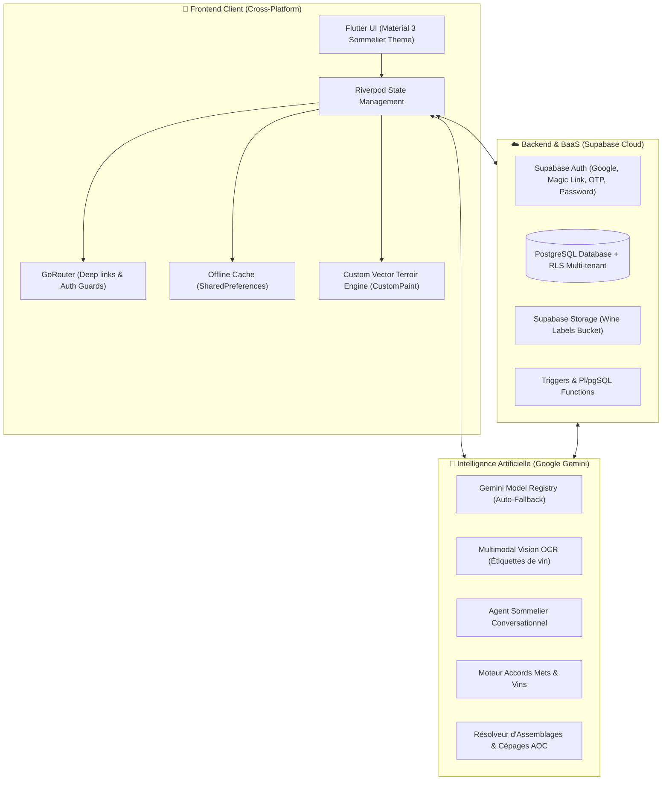

# 🍷 Chatmelier — Architecture Technique & Stack Globale

Ce document présente une vue exhaustive, structurée et claire de l'ensemble de la pile technologique (**Stack**) de l'application **Chatmelier**, depuis le frontend jusqu'au cloud, l'intelligence artificielle, le moteur hors-ligne et les bases de données.

---

## 🗺️ Vue d'Ensemble de l'Architecture

Chatmelier repose sur une architecture moderne **Client-First** & **Offline-First**, interconnectée à un **BaaS Temps Réel (Supabase)** et un **Orchestrateur Multi-LLM Multimodal (Google Gemini API)**.



---

## 1. 📱 Frontend & Interface Utilisateur

| Composant | Technologie / Librairie | Rôle & Justification |
|---|---|---|
| **Framework** | **Flutter 3.47+ / Dart 3.13+** | Développement multiplateforme avec code unique pour **Web, Android, iOS et Desktop**. Rendu graphique ultra-rapide (Impeller / Skia). |
| **Gestion d'État (State Management)** | **Flutter Riverpod (`flutter_riverpod`, `riverpod_annotation`)** | Gestion d'état réactive, découplée et testable avec invalidation automatique, mise en cache granulaire et injection de dépendances (`Provider`, `FutureProvider`, `StateNotifier`). |
| **Routage & Navigation** | **GoRouter (`go_router`)** | Routage déclaratif avec gestion des URLs web, redirection automatique selon l'état d'authentification (`guards`), navigation par onglets (`StatefulShellRoute`) et deep linking (`chatmelier://`). |
| **Design System & Typographie** | **Material 3 personnalisé + Google Fonts** | Palette sommelier de prestige : <br>• **Bourgogne Impérial** (`#8B1E3F`)<br>• **Or Grand Cru** (`#D4AF37`)<br>• **Ardoise & Lie de Vin** (`#18151E` / `#FAF7F2`)<br>Polices soignées : *Playfair Display* (titres) & *Inter* (corps). |
| **Animations & Rendu Visuel** | **`flutter_animate`, `fl_chart`, `cached_network_image`** | Micro-interactions fluides, transitions de cartes, graphiques statistiques de répartition par couleur/région/apogée et mise en cache mémoire/disque des étiquettes. |
| **Internationalisation (i18n)** | **Flutter Localization (`l10n`) + `intl`** | Support natif multi-langues (Français / Anglais) avec fichiers de messages structurés `.arb` et détection automatique de la langue système. |

---

## 2. ☁️ Backend, Base de Données & Stockage (Supabase)

Le backend repose sur l'infrastructure **Supabase**, s'appuyant sur un moteur **PostgreSQL** relationnel performant doté de mécanismes de sécurité stricts.

### A. Base de Données Relationnelle (PostgreSQL 15+)
* **Row Level Security (RLS)** : Isolation stricte des données multi-utilisateurs. Chaque table applique des politiques RLS garantissant qu'un utilisateur ne peut lire ou modifier que les caves et bouteilles auxquelles il est expressément autorisé.
* **Tables Principales** :
  * `profiles` : Données utilisateur, unicité stricte des pseudos (`username`), emails et numéros de téléphone internationaux (`phone_number`).
  * `cellars` : Caves à vin (nom, propriétaire, localisation GPS, description).
  * `cellar_members` : Gestion des accès partagés multi-utilisateurs (rôles : *owner*, *sommelier*, *viewer*).
  * `wines` : Base canonique des vins (nom, producteur, millésime, région, appellation, pays, type, cépages, apogée, notes IA, `image_url`).
  * `bottles` : Exemplaires physiques en cave (quantité, prix d'achat, devise, date d'entrée, étagère/emplacement, statut *in_cellar* / *consumed*).
  * `tasting_notes` : Journal de dégustation enrichi (questionnaires, arômes perçus, notations sur 10, impressions).
  * `friends` & `cellar_invites` : Réseau d'amis, partage de profils de goûts et système d'invitations sécurisées par jeton unique.
  * `app_diagnostic_logs` : Journal d'erreurs et de télémétrie embarqué.

### B. Authentification Multi-Méthodes
* **Google OAuth** : Connexion 1-clic native et web.
* **Lien Magique (Magic Link)** : Connexion sécurisée sans mot de passe envoyée par email.
* **Code OTP à 6 chiffres** : Saisie directe du code numérique avec protocole de secours (`OtpType.email` $\rightarrow$ `OtpType.magiclink` $\rightarrow$ `OtpType.signup`).
* **Email & Mot de passe classique** : Avec gestion des erreurs traduites en français et assistance à la création de compte.
* **Gestion des Indicatifs Téléphoniques** : Normalisation E.164 (`+33...`, `+44...`) avec détection GPS du pays par défaut.

### C. Stockage d'Images (Storage)
* **Bucket `wine-labels`** : Stockage cloud sécurisé des photographies d'étiquettes de bouteilles avec redimensionnement et URLs publiques optimisées.

---

## 3. 🧠 Moteur d'Intelligence Artificielle & Routage Intelligent des Modèles

L'intelligence artificielle de Chatmelier s'appuie sur une stratégie de **routage par niveau de complexité (Task-Tier Routing)** favorisant systématiquement les modèles **Gemini Lite** pour les tâches simples (économies drastiques de tokens et latence ultra-faible) et réservant les modèles **Standard Flash** aux tâches de vision complexe ou de raisonnement profond. **Les modèles Pro sont strictement exclus** pour éviter les surcoûts et la lenteur.

```
                         ┌────────────────────────────────────────┐
                         │       Requête IA entrante              │
                         └───────────────────┬────────────────────┘
                                             │
                       ┌─────────────────────▼─────────────────────┐
                       │  Classification Heuristique de Complexité │
                       │    GeminiModelRegistry.getModelsForTier   │
                       └─────────────┬─────────────────┬───────────┘
                                     │                 │
             ┌───────────────────────┘                 └───────────────────────┐
             │ [Tâches Simples / Enrichissement Textuel]                       │ [Vision Multimodale / Menus Complexes]
             │ Tier: litePreferred                                             │ Tier: standardFlashPreferred
             ▼                                                                 ▼
┌─────────────────────────────┐                                   ┌─────────────────────────────┐
│ 1. Gemini Flash-Lite Latest │                                   │ 1. Gemini Flash Latest      │
│ 2. Gemini 2.5 Flash-Lite    │ (Fallback si 429)                 │ 2. Gemini 2.5 Flash         │ (Fallback si 429)
│ 3. Gemini 2.0 Flash-Lite    │ ───────────────►                  │ 3. Gemini 3.7 / 3.6 Flash   │ ───────────────►
│                             │                                   │                             │
│ ➔ Fallback : Standard Flash │                                   │ ➔ Fallback : Flash-Lite     │
└─────────────────────────────┘                                   └─────────────────────────────┘
  ❌ Modèles Pro (gemini-pro) : STRICTEMENT EXCLUS de tous les tiers (coûteux et superflus).
```

### Grille de Routage par Fonctionnalité :

| Fonctionnalité | Tier Appliqué | Modèles Prioritaires | Justification |
|---|---|---|---|
| **Enrichissement Vin Texte** (`enrichWineFromText`) | `GeminiTaskTier.litePreferred` | `gemini-flash-lite-latest`, `gemini-2.5-flash-lite` | Simple extraction JSON de métadonnées depuis un titre (millésime, cépages, apogée). Le modèle Lite est largement suffisant, quasi-instantané et 2x moins cher. |
| **Synchronisation Hors-Ligne** (`_enrichWineMetadata`) | `GeminiTaskTier.litePreferred` | `gemini-flash-lite-latest`, `gemini-2.5-flash-lite` | Enrichissement asynchrone en arrière-plan des bouteilles scannées ou ajoutées hors-ligne. |
| **Chat Sommelier (Requêtes Simples & Factual)** | `GeminiTaskTier.litePreferred` | `gemini-flash-lite-latest`, `gemini-2.5-flash-lite` | Questions courantes ("Combien de Bordeaux ?", "Un rouge pour ce soir", salutations, prix moyen). Réponse en <500ms. |
| **Vision OCR Étiquettes** (`scanWineLabel`) | `GeminiTaskTier.standardFlashPreferred` | `gemini-flash-latest`, `gemini-2.5-flash` | Nécessite une haute précision visuelle pour les étiquettes calligraphiées, petits millésimes ou éclairage tamisé. Fallback sur Lite si quota atteint. |
| **Chat Sommelier (Menus Complexes & Stratégie)** | `GeminiTaskTier.standardFlashPreferred` | `gemini-flash-latest`, `gemini-2.5-flash` | Menus gastronomiques 4 services, accords mets-vins à contraintes multiples, comparatifs de garde sur 10 ans. |

### Modules IA Intégrés :
1. **Multimodal Vision OCR (`LabelScannerService`)** :
   - Analyse instantanée de photos d'étiquettes de vin (caméra ou galerie).
   - Extraction structurée JSON : domaine/producteur, cuvée, millésime, appellation, classification (Grand Cru, etc.), cépages probables, plage d'apogée optimale et description sommelier.
2. **Chatmelier — Sommelier Conversationnel (`ChatNotifier`)** :
   - Assistant conversationnel temps réel spécialisé dans l'œnologie.
   - Injection dynamique de contexte : inventaire complet de la cave active, profil de goût personnalisé de l'utilisateur, préférences des invités présents, budget et occasion.
3. **Moteur d'Accords Mets & Vins (`WineFoodMatcher`)** :
   - Algorithme hybride croisant gastronomie et inventaire de cave à travers 16 catégories culinaires (viandes rouges, gibier, fruits de mer, fromages affinés, desserts, cuisine épicée, etc.).
   - Système de scoring d'adéquation et recommandations alternatives.
4. **Résolution Experte des Assemblages (`GrapeBlendResolver`)** :
   - Base de connaissances œnologiques intégrée pour reconstituer automatiquement les cépages et pourcentages d'AOC (ex : Bandol $\rightarrow$ *Mourvèdre / Grenache / Cinsault*, Chablis $\rightarrow$ *100% Chardonnay*).
5. **Suivi & Contrôle des Coûts IA (`AiCostTrackerService`)** :
   - Comptabilisation précise des tokens en entrée et sortie, tarification au million de tokens adaptée (0.0375$/M tokens pour Lite vs 0.075$/M tokens pour Flash), enregistrement des coûts réels et limitation de consommation abusive.

---

## 4. 📴 Résilience & Architecture Hors-Ligne (Offline-First)

Pour fonctionner au fond d'une cave sans réseau, Chatmelier intègre un moteur de synchronisation autonome :

* **Stockage Local** : `SharedPreferences` + `path_provider` pour la persistance locale immédiate.
* **File d'attente d'actions (`OfflineActionQueue`)** :
  Toute action effectuée hors-ligne est immédiatement stockée dans une file d'attente locale :
  * `addBottle`
  * `consumeBottle`
  * `updateBottle`
  * `updateWine`
  * `deleteBottle`
  * `createCellar`
  * `updateCellar`
* **Moteur de Synchronisation (`SyncService`)** :
  * Écoute l'état de la connectivité réseau.
  * Rejoue les actions en arrière-plan avec gestion des conflits et retry exponentiel.
  * Déclenche l'enrichissement IA différé des vins dès que la connexion Internet est rétablie.

---

## 5. 🗺️ Cartographie Vectorielle des Terroirs (Custom Terroir Engine)

Un moteur cartographique sur mesure sans dépendances externes lourdes (pas de Google Maps ou Mapbox obligatoires), entièrement vectoriel et interactif.

* **Technologie** : `CustomPaint`, `SvgPathParser`, `InteractiveViewer`.
* **Jeux de données géographiques intégrés** :
  * Données mondiales et continentales issues de *Natural Earth Data*.
  * Contours officiels français *IGN Lambert-93* et bassins hydrographiques fluviaux.
  * Géoréférencement des délimitations des appellations A.O.C. et climats.
* **Niveaux d'Exploration Terroir** :
  1. **Continent** (Bassin viticole mondial).
  2. **Pays** (Région & contours nationaux).
  3. **Vignoble** (Sous-régions & vallées fluviales).
  4. **Cru & Terroir** (Exposition solaire, courbes de niveau, géologie).
* **Carte à Gratter / Scratch Map** :
  * Révélation dynamique et dorée des terroirs selon les stocks réels et les vins dégustés.
  * Zoom fluide jusqu'à **10x (1000%)** avec contrôles tactiles (double-tap, boutons de zoom flottants, recentrage et mode plein écran immersif).

---

## 6. 📍 Géolocalisation & Proximité Intelligente

* **Services** : `geolocator`, `network_info_plus`, `CellarLocationService`.
* **Détection automatique de présence** : Calcul géodésique (formule de Haversine) entre la position GPS actuelle et les coordonnées des caves de l'utilisateur.
* **Reconnaissance Wi-Fi** : Bascule automatique sur la cave du domicile lorsque le SSID correspondant est détecté.
* **Indicatifs Téléphoniques Mondiaux (`PhoneDialCodeHelper`)** : Présélection automatique de l'indicatif national selon la position GPS ou les préférences régionales (FR, UK, US, etc.).

---

## 7. 📁 Arborescence & Organisation du Code

Le projet adopte la convention **Feature-First Architecture** recommandée pour les applications Flutter d'envergure :

```
lib/
├── config/                  # Constantes globales, thème et routes
│   ├── constants.dart
│   ├── router.dart          # GoRouter configuration & guards
│   └── theme.dart           # Thème Sommelier (Light/Dark)
├── features/                # Modules fonctionnels indépendants
│   ├── auth/                # Authentification, profils, profil de goûts, coûts IA
│   ├── cellar/              # Gestion de cave, bouteilles, filtres, terroirs, partage
│   ├── chat/                # Sommelier virtuel IA (Chatmelier conversationnel)
│   ├── checkout/            # Sortie & consommation de bouteilles
│   ├── friends/             # Amis, partages de goûts et réseau
│   ├── journal/             # Journal de dégustation & questionnaires
│   ├── offline/             # File d'actions hors-ligne & synchronisation
│   ├── scan/                # Scanner OCR multimodal d'étiquettes
│   ├── scratchcard/         # Carte des terroirs interactive & planisphère
│   ├── stats/               # Graphiques, statistiques de cave & valorisation
│   └── voice/               # Commandes vocales et synthèse
├── shared/                  # Briques réutilisables partagées
│   ├── providers/           # Fournisseurs Riverpod transverses (Supabase, Auth)
│   ├── services/            # Modèles IA, géolocalisation, lieux personnalisés
│   ├── utils/               # Logger, formateurs de devises, helpers
│   └── widgets/             # Graphiques de cépages, jauges d'apogée, UI commune
├── l10n/                    # Fichiers d'internationalisation (.arb)
├── app.dart                 # Racine MaterialApp.router
└── main.dart                # Point d'entrée de l'application
```

---

## 8. 🧪 Qualité du Code, Tests & Déploiement

* **Couverture de Tests Automatisés** : **107 tests unitaires, de domaine et de scénarios** (`flutter test`) avec 100% de taux de réussite :
  * Modèles de données et sérialisation JSON.
  * Détection de doublons de cuvées et parcelles distinctes (*La Tourtine* vs *La Miguoua*).
  * Calculs rigoureux des fenêtres d'apogée (*En Garde*, *À l'apogée*, *Dépassé*).
  * Filtrage dynamique des caves et résolution des assemblages de cépages.
  * Apprentissage incrémental des profils de goûts et gestion des aversions.
  * Validation stricte de l'unicité des pseudos, téléphones et emails.
  * Moteur de synchronisation hors-ligne et file d'actions.
* **Analyse Statique** : `flutter analyze` validé sans aucun avertissement ni erreur (**0 issues**).
* **Artefacts de Compilation** :
  * **Web Application** : `build/web` (Optimisée SPA/PWA, WASM-ready, tree-shaking des polices).
  * **Android Release** : `build/app/outputs/flutter-apk/app-release.apk` (APK universel optimisé).
